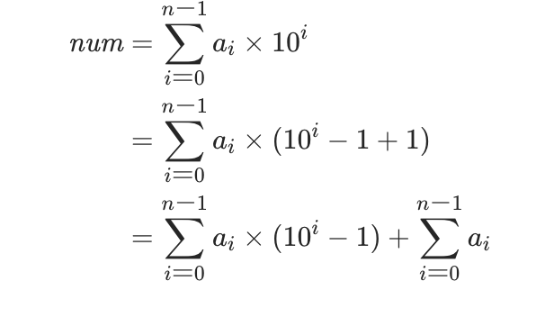

###方法一：模拟（相同）
时间复杂度：O(log num)
###方法二：递归
```java
    class Solution {
        //因为加法是低位到高位的，可以用栈来存储
        public int addDigits(int num) {
            int addNum = 0;//记录每次各位相加的结果
            while (num > 0)
            {
                addNum += num % 10;//个位数相加
                num /= 10;//将十位变成个位
            }
            if (num/10 != 0){
                return addDigits(addNum);//递归
            }
            return addNum;
        }
}

```
###方法三：数学(官方)
  
当 i=0 时，10i −1=0 是 9 的倍数；当 i 是正整数时，10i −1 是由 i 位 9 组成的整数，也是 9 的倍数。因此对于任意非负整数 i，10i −1 都是 9 的倍数。由此可得 num 与其各位相加的结果模 9 同余。重复计算各位相加的结果直到结果为一位数时，该一位数即为 num 的数根，num 与其数根模 9 同余。

我们对 num 分类讨论：
num 不是 9 的倍数时，其数根即为 num 除以 9 的余数。
num 是 9 的倍数时：
如果 num=0，则其数根是 0；
如果 num>0，则各位相加的结果大于 0，其数根也大于 0，因此其数根是 9。  

时间复杂度：O(1)  
空间复杂度：O(1)
```java
class Solution {
    public int addDigits(int num) {
        return (num - 1) % 9 + 1;
    }
}
```

